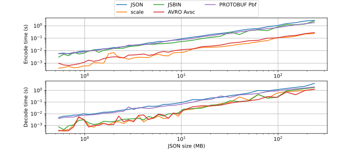
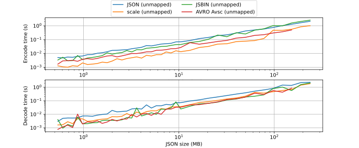

# `scale-ts-benchmark`

This is a fork of [`Adelost/javascript-serialization-benchmark`](https://github.com/Adelost/javascript-serialization-benchmark); see the original for further context.

This fork adds [SCALE TS](https://github.com/paritytech/scale-ts) (and filters out some of the slower/duplicative libraries) with the following codecs:

```ts
const $data = $.field(
  "items",
  $.array($.object(
    $.field("x", $.i32),
    $.field("y", $.f64),
    $.field("z", $.f64),
  )),
)
```




```ts
const $unmapped = $.array($.tuple($.i32, $.f64, $.f64));
```


